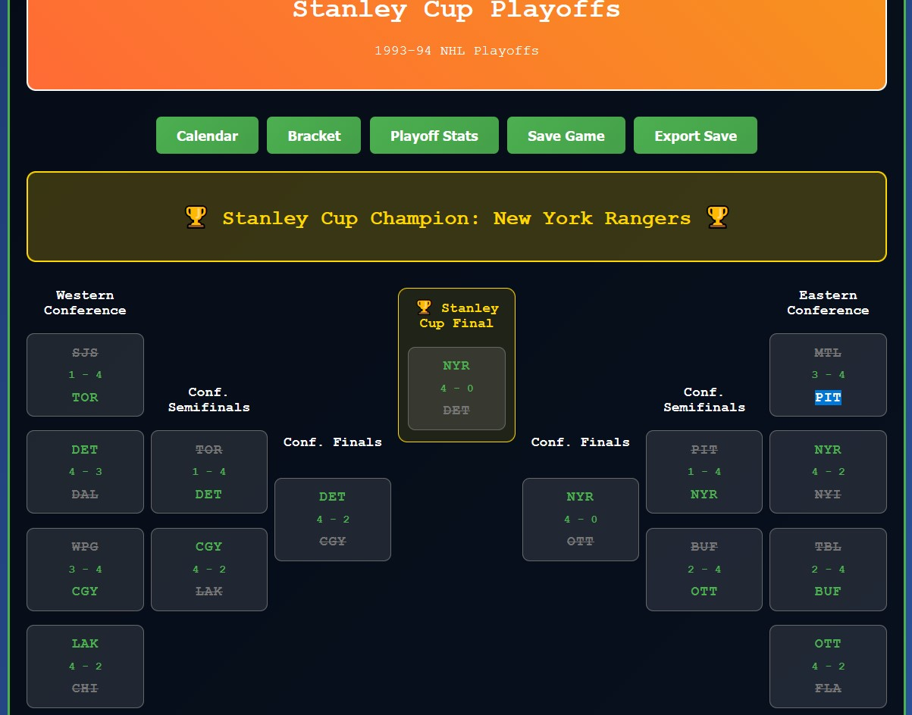

# NHL94 Season Mode

> Honorable mention to Banjo for starting this project

This application simulates the Season Mode for the Sega Genesis game NHL 94, a feature that doesn't exist in the original game.

The idea is to pick a team, play your games and enter the results and stats, while the opponents' results are simulated by the application itself.

# New Features

Playoff support, see tasks.md for details.

# Running

## Install Node.js via dnf
sudo dnf module enable nodejs:22
sudo dnf install nodejs npm -y

## Verify
node --version
npm --version

## Install Vite
cd nhl94-seasonmode
npm init -y
npm install --save-dev vite

## Dev server (hot reload):
npx vite

## Build for production:
npx vite build

## Preview the production build:
npx vite preview
